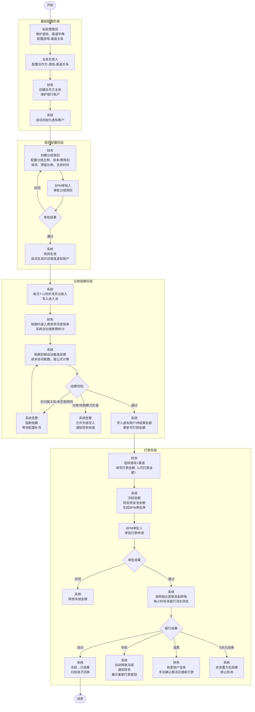

# 大发行模式打款分账系统 PRD（V2）

**版本**：V2.1  
**日期**：2026-04-21  
**状态**：需求变更稿（打款申请改为合作方自主发起）

---

## 一、项目概述

### 1.1 背景与目标

公司在大发行模式下，需要与多个合作方进行收入分账与打款结算。原始设想中，合作方可登录平台查看余额并发起提款，但结合当前实际建设节奏，**结算模块将先于大发行平台整体能力建设落地**，因此系统设计需优先保障“分账计算、打款申请、审批、银企直联支付、资金安全管控”这一核心闭环能力。

本期建设目标：

- **合作方可登录系统发起打款申请，其他主数据维护仍由内部完成**
- **合作方主体信息由内部维护**
- **银行账户由财务统一维护，无需审批**
- **打款申请由合作方自主发起，走 BPM 审批流**
- **分成规则由财务统一配置，走 BPM 审批流**

**核心目标**：构建自动化结算平台，支持从收入入账 → 自动分账计算 → 合作方发起打款申请 → BPM审批 → 银企直联自动打款的全链路闭环，优先确保分账与打款核心能力上线可用。

### 1.2 产品定位

本项目由两个相互协同的系统构成：

1. **大发行打款分账系统**：面向公司内部财务团队、业务负责人、管理人员及外部合作方的 **结算管理平台**，负责合作方主体管理、分成规则配置、T+1 分账计算、合作方发起打款申请、审批流转、结算状态管理等上层业务能力。
2. **银企直联系统**：面向内部财务结算场景与资金组的 **底层资金基建平台**，负责对接银行银企直联接口，提供转账账户管理、余额查询、流水查询、转账执行、回调接收、日志查询等底层资金能力。

两个系统的定位边界如下：

- **大发行打款分账系统**：负责业务数据、结算规则、申请单据、审批状态、冻结解冻与结算金额变更
- **银企直联系统**：负责银行通道能力封装、银行账户能力承载、转账执行编排、银行回调接收、资金侧日志与流水查询
- **统一主数据来源**：合作方主体与合作方收款银行账户以大发行打款分账系统为主数据源，自动同步至银企直联系统
- **禁止反向修改**：从大发行分账系统同步至银企直联系统的公司主体和银行账户，不允许在银企直联系统内修改，以避免主数据不一致

该模式下，大发行打款分账系统作为上层业务系统，银企直联系统作为底层资金基础设施，共同支撑财务结算与资金组资金操作场景。

### 1.3 核心价值

| 价值维度 | 说明 |
|---|---|
| 结算提效 | 每日自动同步前一日收入数据（T+1），完成分账计算后财务可查看各合作方最新可结算金额，减少人工统计与手工核算成本 |
| 统一管控 | 合作方入驻与资质审核、分成规则配置由财务统一操作；打款由合作方自主发起申请，财务通过审批流程进行审核 |
| 审计可追溯 | 所有规则配置、审批、打款、冻结释放均保留完整操作与审批痕迹 |

---

## 一点五、全流程概览



---


> 本系统权限模型：合作方主体、银行账户、分成规则由财务统一维护；打款申请由合作方自主登录发起，财务负责审核审批与资金执行。

---

### 角色定义

| 角色 | 描述 | 主要功能权限 |
|---|---|---|
| **合作方** | 外部合作伙伴，登录平台操作 | 发起打款申请、查看本方结算数据与打款记录 |
| **财务人员** | 核心内部操作者 | 维护合作方主体与银行账户、配置分成规则、查看全量结算与资金数据、处理退票/失败异常 |
| **财务负责人 / 审批人** | BPM 审批链路中的审批角色 | 审批规则配置单、审批打款申请单、查看审批结果与相关明细 |
| **业务负责人** | 负责业务归属的内部角色 | 配置游戏-渠道-合作方主体关系、参与规则审批、按流程参与打款审批、查看所负责范围数据 |
| **系统管理员** | 平台管理角色 | 维护游戏/渠道字典、配置游戏-渠道关联关系、分配用户角色权限与各角色数据范围、流程配置、日志审计、系统参数维护 |

### 权限矩阵

| 功能模块 | 合作方 | 财务人员 | 财务负责人/审批人 | 业务负责人 | 系统管理员 |
|---|---|---|---|---|---|
| 合作方主体管理 | 查看本方 | 创建/编辑 | 查看全量 | 查看所负责范围 | 全量查看 |
| 银行账户管理 | 查看本方 | 创建/编辑 | 查看 | 查看所负责范围 | 查看 |
| 游戏管理 | 查看 | 查看 | 查看 | 查看 | 创建/编辑/停用 |
| 渠道管理 | 查看 | 查看 | 查看 | 查看 | 创建/编辑/停用 |
| 游戏-渠道关系配置 | 无 | 查看 | 查看 | 查看 | 创建/编辑/停用 |
| 游戏-渠道-合作方主体关系配置 | 无 | 查看 | 查看 | 创建/编辑（权限范围内） | 全量查看 |
| 用户角色权限与数据范围管理 | 无 | 无 | 无 | 无 | 全量管理 |
| 分成规则配置 | 无 | 创建/提交审批 | 审批 | 审批/查看 | 查看 |
| 分账结果查看 | 查看本方 | 查看全量 | 查看全量 | 查看所负责范围 | 全量查看 |
| 打款申请发起 | 发起本方申请 | 代发/查看 | 无 | 无 | 无 |
| 打款审批 | 无 | 无 | 审批 | 按流程参与 | 无 |
| 打款执行结果查看 | 查看本方 | 查看全量 | 查看全量 | 查看所负责范围 | 全量查看 |
| 退票/失败处理 | 查看结果 | 处理 | 查看/审批 | 查看 | 查看 |
| 日志审计 | 查看本方相关记录 | 查看业务日志 | 查看审批日志 | 查看权限内日志 | 全量查看 |

---

## 三、产品范围与建设原则

### 3.1 本期建设范围

本期优先建设以下核心模块：

1. **合作方主体管理**
2. **银行账户管理**
3. **游戏与渠道管理**（字典维护 + 游戏-渠道关系配置，系统管理员）
4. **合作方-游戏-渠道关系管理**（独立页面，业务负责人配置）
5. **分成规则配置与审批**
6. **T+1 分账计算引擎**
7. **合作方自主发起打款申请**
8. **BPM 审批流对接**
9. **银企直联自动打款**
10. **资金池余额校验、冻结释放、失败回账确认**
11. **全平台数据看板与审计能力**

### 3.2 建设原则

- **先结算，后平台**：优先保障分账与打款闭环，不依赖合作方门户能力
- **先可用，后集成**：若 BPM 或大发行平台部分能力未完成，上线节奏依赖 BPM 就绪，不设手工维护兜底
- **业务上收、资金下沉**：大发行分账系统承载业务结算逻辑，银企直联系统承载银行能力与资金能力
- **合作方主动发起**：打款申请由合作方自主登录发起，财务负责审批与资金执行
- **主数据单向同步**：合作方主体、合作方银行账户从大发行分账系统同步至银企直联系统，银企直联系统不得反向修改
- **强审计**：所有关键动作必须可追溯
- **保守放行**：涉及资金流转时，以“宁可挂起，不可错付”为原则

---

## 四、功能需求（EARS）

> 使用 EARS 语法撰写，确保需求可验证、可测试。

### 4.1 合作方主体管理

- **REQ-F-101**：系统应支持财务人员或系统管理员创建合作方主体档案。
- **REQ-F-102**：系统应在合作方主体档案中记录公司名称、统一社会信用代码、法人姓名、法人证件信息、联系人姓名、联系人手机号、联系人邮箱（联系人可以增删改）。
- **REQ-F-103**：当财务人员维护合作方主体信息时，系统应记录修改人、修改时间。

### 4.2 银行账户管理

- **REQ-F-201**：系统应支持财务人员为合作方主体新增和编辑银行账户，每个合作方主体有且仅有一个银行账户。
- **REQ-F-202**：系统应在银行账户信息中记录账户名称、开户银行、开户支行、银行账号、联行号及账户用途。
- **REQ-F-203**：当财务人员保存银行账户信息时，系统应直接生效，不触发审批流程；编辑保存后覆盖原账户信息，旧信息记入操作日志。
- **REQ-F-204**：当合作方发起打款申请时，系统应校验收款账户信息是否完整（账户名称、开户银行、开户支行、银行账号、联行号均不为空），信息不完整时拒绝提交并提示完善账户信息后再发起。
- **REQ-F-205**：当打款申请提交时，系统应将收款账户的完整信息（账户名称、开户银行、开户支行、银行账号、联行号）快照存储至打款申请单，确保账户后续编辑变更不影响历史打款记录的展示与追溯。
- **REQ-F-206**：系统应在操作日志中记录银行账户的新增与编辑操作，包含操作人、操作时间及变更前后的完整账户信息。
- **REQ-F-207**：当合作方主体或银行账户在大发行打款分账系统中创建或更新后，系统应自动同步对应主数据至银企直联系统。
- **REQ-F-208**：系统应将从大发行打款分账系统同步至银企直联系统的合作方主体和银行账户标记为”只读来源数据”，不允许在银企直联系统中修改。

### 4.3 分成规则配置

- **REQ-F-301**：系统应仅允许财务人员创建分成规则；规则审批通过后内容不可修改，如需调整须创建新规则；规则无手动停用操作，以生效结束时间自然到期；每条分成规则绑定一个合作方主体、一个游戏、一个渠道，即分成规则的生效维度为"合作方+游戏+渠道"。
- **REQ-F-302**：当财务人员创建分成规则时，系统应触发 BPM 审批流程。
- **REQ-F-303**：当财务创建分成规则时，系统应在提交时校验所填生效开始时间与结束时间范围内是否存在已出账记录（同一"合作方+游戏+渠道"���度）；若存在已出账日期，系统应拒绝提交并提示财务调整起止时间以避开已出账日期。
- **REQ-F-304**：系统应禁止同一"合作方+游戏+渠道"组合存在时间区间重叠的多条已审批通过规则版本；提交审批时系统应同步校验时间区间是否与已生效规则冲突，冲突时不允许提交。
- **REQ-F-305**：当系统执行分账计算时，系统应依据出账日期匹配生效中的规则版本；规则"生效中"的判断条件为：BPM 审批已通过，且出账日期在规则填写的生效开始时间与结束时间之间（含边界）；若匹配不到生效中的规则，则该"合作方+游戏+渠道"当日不出账，跳过并生成告警。
- **REQ-F-306**：规则审批通过后，其所有字段（分成比例、费用扣除项、生效开始/结束时间等）均不可修改，系统应在界面上禁用编辑入口。
- **REQ-F-307**：当新建规则 BPM 审批驳回时，该规则标记"已驳回"，不生效；财务可重新创建新规则提交审批。
- **REQ-F-308**：系统应支持从已有规则复制创建新规则。
- **REQ-F-309**：系统应将每条分账计算结果关联至规则ID。
- **REQ-F-310**：系统应在规则详情中展示审批状态、审批通过时间、生效开始时间与生效结束时间。

### 4.4 分账计算引擎

- **REQ-F-401**：系统应每日同步浑天仪 T+1 收入数据，按”合作方+游戏+渠道”维度累加至收入池，收入池金额财务只读可见，不直接进入待结算金额，待结算周期结算后方可转入；当日数据同步失败时，系统应告警通知财务并不触发结算；补录数据应按实际产生日期归入对应账期收入池，若对应账期已完成结算，系统应告警提示财务确认是否重新触发结算。
- **REQ-F-402**：当结算周期到期时，系统应触发分账计算：成本项金额由系统自动从浑天仪取数；费用项金额由财务录入月度账单总额及实际产生账期，系统自动按账期均分拆分，财务可对各账期金额手动调整，提交前系统校验各账期合计 = 月度账单总额，提交后锁定不可修改；计算时费用项按**实际产生账期**匹配对应生效规则，取该规则中配置的费用项比例，与录入扣减账期无关；系统读取本期预留金额（未配置则默认 0），按公式 `本期分账金额 = (收入 - Σ成本项金额×成本项比例 - Σ费用项金额×对应规则费用项比例) × 分成比例` 计算，`本期转入待结算 = 本期分账金额 - 本期预留金额`，预留金额进入预留资金池。
- **REQ-F-403**：系统应在分成规则中支持配置预留比例；每期结算时系统自动按 `本期预留金额 = 本期收入池流水 × 预留比例` 计算并存入预留资金池；财务可修改未出账账期对应规则的预留比例，已出账账期的预留比例不可修改；未配置预留比例时默认为 0。
- **REQ-F-404**：系统应在分账明细中独立记录每期预留金额及预留资金池累计余额，财务可查看历史各期预留记录；预留资金池金额不计入待结算金额，合作方日常不可提取；当分成规则最后一个结算账期到期时，系统在完成正常结算后自动触发预留资金池清算，无需财务手动操作：统计合作期内所有未扣减费用合计（未扣减费用指已发生但财务未录入的费用，超期按 0 计算的费用项不计入），若预留池余额 ≥ 未扣费用，差额自动转入合作方待结算金额并清零预留资金池；若预留池余额不足，系统通知财务，预留资金池保持冻结状态直至财务手动确认合作方补充到账后清零。
- **REQ-F-405**：系统应在每个结算账期开始前自动生成费用录入待办，截止时间为下一账期开始前的最后一天；截止时间到期仍未录入的费用项，系统应自动将本期金额置为 0，待办标注"已超期-按0计算"；漏录费用可在下期通过正负金额冲正处理。
- **REQ-F-406**：账期到期时，若游戏+渠道无合作方归属关系，或账期未匹配到生效中规则，系统应阻断结算并告警，不写入待结算；若费用项未录入（待办超期），系统自动按 0 计算，**不阻断结算**，告警提示财务；结算计算完成后：当本期分账金额 < 0 或本期转入待结算 < 0 时，**不阻断结算**，允许负值写入待结算，告警通知财务核查；所有阻断情形均不自动重试。
- **REQ-F-407**：系统应在合作方主体创建完成时，自动初始化该主体的虚拟账户体系；当游戏+渠道+规则关系确定（规则审批通过）后，自动生成对应维度虚拟账户，各金额字段初始为 0；每次结算后将分账结果累加至对应虚拟账户的待结算金额，并同步更新可打款金额；合作方发起打款申请时，打款金额不得超过该维度下的可打款金额。
- **REQ-F-408**：系统应按结算周期保存分账明细，包含收入池金额、各成本项本期录入金额及比例、各费用项本期录入金额及比例、本期分账金额、本期预留金额、本期转入待结算金额，以支持审计与对账。
- **REQ-F-409**：系统应在数据模型中预留阶梯式分成能力的扩展字段。
### 4.5 合作方自主发起打款

- **REQ-F-501**：系统应仅允许合作方发起打款申请；财务人员可代合作方发起（代发场景须在申请单中标注"代发"及代发原因）。
- **REQ-F-502**：当合作方发起打款申请时，系统应要求选择游戏与渠道，并手动填写打款金额及备注；系统应根据游戏-渠道-合作方主体关系自动关联收款合作方主体及其银行账户，不允许手动修改收款账户。
- **REQ-F-503**：当合作方提交打款申请时，系统应校验：打款金额 ≤ 该维度下的可打款金额（存储字段）、合作方主体状态为"合作中"、收款账户信息完整，不满足任一条件时拒绝提交并提示原因。
- **REQ-F-504**：当上述校验通过后，系统应立即冻结对应金额，并同步校验资金池主账户余额；若余额不足，系统通知资金组成员补充资金，不阻断申请提交流程。
- **REQ-F-505**：当打款申请提交成功时，系统应自动生成 BPM 审批单。
- **REQ-F-506**：当打款申请被驳回时，系统应立即释放冻结金额。

### 4.6 BPM 审批流

- **REQ-F-601**：系统应支持规则配置单与打款申请单分别对接 BPM 审批流。
- **REQ-F-602**：当系统成功发起 BPM 流程时，系统应回写 BPM 实例号、当前审批节点与审批状态。
- **REQ-F-603**：当 BPM 返回审批通过结果时，系统应自动推进业务状态。
- **REQ-F-604**：当 BPM 返回审批驳回结果时，系统应自动结束当前业务单并执行对应的冻结释放逻辑。

### 4.7 银企直联打款与失败处理

- **REQ-F-701**：当打款申请审批通过且资金池余额充足时，系统应调用银企直联系统发起转账指令。
- **REQ-F-702**：当银企直联系统完成转账执行后，系统应接收银企直联返回的资金流水单号，并将其关联至对应的打款申请单，建立打款申请单号与资金流水单号的映射关系。
- **REQ-F-703**：当银企直联系统接收到银行回调结果时，系统应将转账结果异步通知大发行打款分账系统。
- **REQ-F-704**：当打款成功时，系统应将冻结金额转为已结算金额，并生成打款成功记录。
- **REQ-F-705**：当打款成功时，系统应自动下载并归档电子回单。
- **REQ-F-706**：当银行返回转账失败结果时，说明资金未出账，系统应将原打款申请单状态标记为”转账失败”，将冻结金额自动释放回可结算金额，通知财务与合作方，并在申请单详情页展示”重新打款”按钮，由合作方手动触发，需走完整申请与审批流程。
- **REQ-F-707**：当跨行转账成功后，接收方银行因收款信息不符将资金退回时，银企直联系统应通过接口获取退回流水单，并将退回流水单与原转出流水单建立关联关系。
- **REQ-F-708**：当退回流水单与原转出流水单关联完成后，系统应将原打款申请单状态更新为"已退票-待财务确认"，通知财务核查收款账户信息，并由财务手动触发解冻操作，操作完成后系统将对应的已结算金额回滚为可结算金额；合作方重新发起打款时，游戏+渠道+合作方主体必须与原申请一致（由规则绑定决定，不可手动指定），需走完整申请与审批流程。
- **REQ-F-709**：当退票处理完成后，系统应通知财务退票结果、退票原因、原打款申请单号及退回流水单号，并提示财务核查收款账户信息（如账户名/账号是否匹配），确认无误后手动触发解冻。
- **REQ-F-710**：当财务手动触发解冻后，系统应将已结算金额回滚为可结算金额，打款申请单状态更新为"已退票-已解冻"，并在申请单详情页展示"重新打款"按钮，由合作方手动触发；游戏+渠道+合作方主体与原申请一致，需走完整申请与审批流程。
- **REQ-F-711**：打款指令发出后，申请单状态进入”打款中”；系统应每小时主动查询一次银企资金流水单状态，查询到最终状态（成功/失败/退票）时立即进入对应处理流程并停止轮询；超过 8 天仍未获取最终状态时，标记申请单状态为”无结果”，停止轮询。；轮询期间冻结金额持续占用，不自动释放。
- **REQ-F-713**：当前置机通信异常（调用银企直联系统失败）时，系统应自动重试最多 3 次；重试失败后标记为”待人工处理”，系统通知财务，由财务线下联系系统技术负责人沟通处理。

### 4.8 资金池与额度控制

- **REQ-F-801**：系统应在合作方提交打款申请时同步校验资金池主账户余额；若余额不足，系统通知资金组成员补充资金，不阻断申请提交流程。
- **REQ-F-802**：当打款申请审批通过后执行打款时，系统应校验资金池余额；若余额不足，则将打款状态标记为”排队中”，不执行打款操作，直至资金充足。
- **REQ-F-803**：系统应按审批通过时间顺序执行打款排队。
- **REQ-F-804**：当排队中的申请尚未执行时，系统应保持其冻结金额不释放。
- **REQ-F-805**：当资金池余额恢复充足时，系统应自动恢复排队中的打款任务。
- **REQ-F-806**：系统应支持展示资金池余额、今日待打款金额与排队中总额。
- **REQ-F-807**：系统应对结算触发操作保证幂等性，同一结算周期不允许重复触发结算，已完成结算的账期再次触发时系统应拒绝并提示"该账期已完成结算"。

### 4.9 数据看板与审计

- **REQ-F-901**：系统应支持财务查看全平台合作方待结算金额、冻结金额、已结算金额及打款记录。
- **REQ-F-902**：系统应支持业务负责人查看其权限范围内的合作方结算数据。
- **REQ-F-903**：系统应支持按合作方、游戏产品、时间范围查询分账明细。
- **REQ-F-904**：系统应支持按申请状态、审批状态、打款结果查询打款记录。
- **REQ-F-905**：系统应记录合作方主体、银行账户、规则配置、审批维护、打款执行等关键操作日志。
- **REQ-F-906**：系统应支持导出分账明细、打款记录与审批记录。

### 4.10 游戏与渠道管理

- **REQ-F-1001**：系统应支持系统管理员维护游戏列表，包括新增、编辑和停用游戏。
- **REQ-F-1002**：系统应支持系统管理员维护渠道列表，包括新增、编辑和停用渠道。
- **REQ-F-1003**：系统应在游戏信息中记录游戏名称、游戏编码、状态及备注。
- **REQ-F-1004**：系统应在渠道信息中记录渠道名称、渠道编码、状态及备注。
- **REQ-F-1005**：当游戏或渠道被停用时，系统应禁止在新建分成规则时引用该游戏或渠道；已有数据不受影响。
- **REQ-F-1006**：系统应在分成规则、分账明细等需要关联游戏或渠道的功能中，统一从游戏/渠道列表中选取，不允许手工输入。
- **REQ-F-1007**：系统应支持系统管理员配置游戏与渠道的关联关系（游戏-渠道关系），一个游戏可关联多个渠道，一个渠道可关联多个游戏。
- **REQ-F-1008**：当系统管理员停用游戏-渠道关联关系时，系统应禁止在新建游戏-渠道-合作方主体关系时引用该组合；已有数据不受影响。
- **REQ-F-1009**：系统应支持业务负责人配置游戏-渠道-合作方主体关系，用于指定某游戏+渠道组合的收入归属哪个合作方主体，及对应的业务负责人。
- **REQ-F-1010**：当业务负责人配置游戏-渠道-合作方主体关系时，系统应校验所选游戏-渠道组合已在系统管理员维护的游戏-渠道关系中存在，否则不允许提交。
- **REQ-F-1011**：系统应禁止同一游戏+渠道组合同时关联多个合作方主体（唯一性约束）；当某游戏-渠道-合作方主体关系存在生效中的分成规则时，系统应禁止停用该关系，需等所有生效规则到期后方可停用；若需变更合作方，需在旧关系所有规则到期后，停用旧关系，再创建新关系。
- **REQ-F-1012**：当游戏-渠道-合作方主体关系创建后，系统应将其作为分账计算引擎中收入归因与规则匹配的依据。

---

### 5.1 模块一：合作方主体管理

#### 5.1.1 模块定位

合作方主体管理用于维护所有合作结算对象的主数据。合作方主体档案由内部财务统一维护，作为分账规则、银行账户、打款申请、数据权限等模块的基础主实体。

#### 5.1.2 主体档案字段

| 字段 | 类型 | 说明 |
|---|---|---|
| 主体ID | String | 系统自动生成 |
| 公司名称 | String | 合作方公司全称 |
| 统一社会信用代码 | String | 唯一识别主体 |
| 法人姓名 | String | 法定代表人 |
| 法人证件号 | String | 敏感信息，加密存储 |
| 联系人姓名 | String | 日常对接人 |
| 联系人手机号 | String | 联系方式 |
| 联系人邮箱 | String | 联系方式 |
| 合作状态 | Enum | 合作中 |
| 创建人 | Reference | 创建用户（财务人员） |
| 创建时间 | DateTime | 创建时间 |
| 最后修改人 | Reference | 最后修改用户 |
| 最后修改时间 | DateTime | 最后修改时间 |

#### 5.1.3 关键规则

- 一个合作方主体有且仅有一个银行账户
- 一个合作方主体可代理多个游戏-渠道组合，每个组合由业务负责人通过"游戏-渠道-合作方主体关系"配置
- 分成规则以"合作方+游戏+渠道"为绑定维度，同一组合同时只能有一条生效规则
- 虚拟账户的待结算/提款审批中（冻结）/已结算/预留资金池金额按"合作方+游戏+渠道+规则"维度独立核算
- 业务负责人的数据权限范围由其配置的"游戏-渠道-合作方主体关系"决定
- 合作方主体不支持停用操作
- 当合作方主体尚未配置任何游戏-渠道-合作方主体关系（三方关系）时，允许财务或系统管理员删除该主体；删除时系统应同步删除该主体的银行账户记录
- 当合作方主体已存在任意三方关系时，系统应禁止删除并提示"该合作方已绑定游戏渠道关系，无法删除"

---

### 5.2 模块二：银行账户管理

#### 5.2.1 设计原则

本期银行账户管理由财务统一维护，不走审批，以提高执行效率。账户创建后可立即用于合作方发起打款申请。

同时，大发行打款分账系统中的合作方主体与合作方银行账户，是银企直联系统中对应转账对象主数据的唯一来源。银企直联系统仅承载资金执行能力，不作为该类业务主数据的编辑入口。

#### 5.2.2 账户字段

| 字段 | 类型 | 说明 |
|---|---|---|
| 账户ID | String | 系统自动生成 |
| 所属合作方主体 | Reference | 关联主体（唯一，1:1） |
| 账户名称 | String | 收款账户名称 |
| 开户银行 | String | 银行名称 |
| 开户支行 | String | 支行名称 |
| 银行账号 | String | 对公账号，加密存储 |
| 联行号 | String | 跨行转账使用 |
| 账户用途 | String | 备注说明 |
| 创建人 | Reference | 财务用户 |
| 创建时间 | DateTime | 创建时间 |
| 最后修改人 | Reference | 最后编辑用户 |
| 最后修改时间 | DateTime | 最后编辑时间 |

#### 5.2.3 管理规则

- 每个合作方主体有且仅有一个银行账户
- 新增账户后即时生效
- 编辑账户时覆盖保存，无需审批，变更前后的完整信息记入操作日志
- 无停用与删除操作，账户信息有误时直接编辑更正
- 发起打款前系统校验账户信息完整性，存在空字段时不允许提交
- 账户新增或编辑后自动同步至银企直联系统
- 打款申请提交时系统快照当时完整账户信息，后续账户变更不影响历史打款记录
- 银企直联系统中的同步数据仅允许查询与使用，不允许反向修改

---

### 5.3 模块三：分成规则配置

#### 5.3.1 规则模型

每条规则绑定”合作方+游戏+渠道”，审批通过后内容不可修改。如需调整，需创建新规则并设置不重叠的时间区间。

##### 规则字段

| 字段 | 类型 | 说明 |
|---|---|---|
| 规则ID | String | 系统自动生成 |
| 合作方主体 | Reference | 关联合作方 |
| 游戏 | Reference | 关联游戏 |
| 渠道 | Reference | 关联渠道 |
| 分成比例 | Decimal | 合作方分成百分比 |
| 预留比例 | Decimal | 每期从收入池流水中提取存入预留资金池的比例，未填则默认 0；已出账账期后不可修改 |
| 费用扣除项 | List | 见下方子表，可配置多个 |
| 生效开始时间 | Date | 财务手动填写 |
| 生效结束时间 | Date | 财务手动填写 |
| 结算周期 | Enum | 按月 / 按周 |
| 备注 | String | 可选说明 |
| 规则状态 | Enum | 草稿 / 审批中 / 生效中 / 已到期 / 已驳回 |
| BPM实例号 | String | BPM 系统返回 |
| 审批通过时间 | DateTime | BPM 审批通过时系统自动写入 |
| 创建人 | Reference | 财务用户 |
| 创建时间 | DateTime | 创建时间 |

##### 成本/费用扣减项子表（规则中配置，每账期自动取数或录入金额）

成本项和费用项使用同一结构，通过”类型”字段区分，每条规则可配置多个：

| 字段 | 类型 | 说明 |
|---|---|---|
| 扣减项ID | String | 系统自动生成 |
| 所属规则 | Reference | 关联规则 |
| 类型 | Enum | 成本 / 费用 |
| 项目名称 | String | 财务自定义，如”通道费”、”云服务费用”等 |
| 成本子类型 | Enum | 支付通道成本 / 渠道成本（成本项专用） |
| 浑天仪标识号 | String | 成本项专用；支付通道成本填支付通道号，渠道成本填渠道号，用于结算时自动从浑天仪拉取对应流水 |
| 比例 | Decimal | 规则创建时配置，审批通过后不可修改 |

每账期结算时，系统为各扣减项生成账期金额记录：

| 字段 | 类型 | 说明 |
|---|---|---|
| 账期金额记录ID | String | 系统自动生成 |
| 所属扣减项 | Reference | 关联扣减项 |
| 账期 | Date | 对应账期 |
| 流水金额 | Decimal | 成本项专用：系统按浑天仪标识号自动拉取该账期流水，只读 |
| 当期金额 | Decimal | 成本项：流水金额 × 比例（系统自动计算）；费用项：系统按月度账单自动拆分后财务可调整，提交后锁定 |
| 来源月度账单 | Reference | 费用项专用，关联所属月度账单记录 |

费用项月度账单记录：

| 字段 | 类型 | 说明 |
|---|---|---|
| 账单ID | String | 系统自动生成 |
| 所属扣减项 | Reference | 关联费用扣减项 |
| 实际产生账期 | Date | 费用实际发生的月份，如 2026-04，用于匹配对应规则 |
| 录入扣减账期（各期） | Date | 系统自动拆分或财务调整后的各结算账期 |
| 关联规则ID | Reference | 系统按实际产生账期自动匹配生效规则，只读 |
| 账单总额 | Decimal | 财务录入的月度账单金额 |
| 拆分状态 | Enum | 待调整 / 已提交 |
| 各账期拆分金额合计 | Decimal | 系统自动汇总，提交时须 = 账单总额 |
| 创建人 | Reference | 财务用户 |
| 创建时间 | DateTime | 创建时间 |

计算公式：
```
本期分账金额 = (收入 - Σ(成本项本期录入金额 × 成本项比例) - Σ(费用项本期录入金额 × 费用项比例)) × 分成比例
本期转入待结算 = 本期分账金额 - 本期预留金额

收入           = 浑天仪当期该合作方+游戏+渠道总流水（收入池金额）
成本/费用项金额 = 财务按账期手工录入，当期录入、当期生效；若费用出账周期与结算账期不一致（如月度账单、双周结算），
                 由财务将账单金额拆分录入到各结算账期，系统不做自动拆分；账单未出前填 0
预留金额       = 独立配置，支持提前批量录入多个账期，进入预留资金池，不计入待结算
```

#### 5.3.2 审批机制

规则配置统一由财务发起，走 BPM 审批流。

**规则不可修改**：规则审批通过后，所有字段内容不可修改；如需调整，须重新创建一条新规则，并设置不与已有规则重叠的时间区间。

**规则无手动停用**：规则以生效结束时间自然到期，到期后状态自动变更为"已到期"，不提供手动停用操作。

**生效判断**：规则是否"生效中"的条件为：BPM 审批已通过，且当日出账日期在 [生效开始时间, 生效结束时间] 之间。

**提交校验**（同时满足以下三项才允许提交）：
1. 结束时间 > 开始时间
2. 所填时间区间内不存在已出账记录（同一"合作方+游戏+渠道"维度）
3. 所填时间区间不与该维度已审批通过的其他规则重叠

**驳回处理**：规则被驳回后标记"已驳回"，不生效；财务可重新创建规则提交审批。

#### 5.3.3 关键流程

```text
财务选择合作方+游戏+渠道
  ↓
配置成本项：
  支付通道成本：系统调浑天仪接口拉取该渠道下支付通道列表
               财务选择一个或多个支付通道，并为每个填写比例
  渠道成本：渠道已由规则绑定确定，财务直接填写比例
  ↓
配置费用项：填写项目名称（自定义）+ 比例
  ↓
填写分成比例、生效开始/结束时间、结算周期
  ↓
提交，系统发起 BPM 审批
  ↓
审批通过 → 规则生效，所有字段锁定不可修改
  ↓
后续分账按收入产生日期匹配生效中的规则版本
  ↓
规则以生效结束时间自然到期，状态变更为"已到期"
```

---

### 5.4 模块四：分账计算引擎

#### 5.4.1 总体流程

分账计算引擎分为两个阶段：**每日收入同步**（将 T+1 收入写入收入池）和**周期结算触发**（结算周期到期后由财务发起，将收入池金额经公式计算后转入待结算）。

```text
【每日收入同步阶段】
系统每日同步浑天仪 T+1 收入数据
  ↓
按”游戏+渠道”查找游戏-渠道-合作方主体关系，确定归属合作方
  ↓
按”合作方+游戏+渠道”维度累加写入收入池（财务只读，不直接进入待结算）
  ↓
若无归属关系或无匹配生效规则：跳过并告警

【结算周期触发阶段】
结算账期由规则自动推算（从生效开始时间按结算周期步进，如双周则 4/1-4/14、4/15-4/30…）
账期到期时，系统自动触发结算计算，无需财务手动操作
  ↓
系统读取本期各费用项录入金额（截止时间前未录入的项自动按 0 计算）
成本项金额由系统自动从浑天仪取数
  ↓
系统读取本期预留比例，自动计算本期预留金额（= 本期收入池流水 × 预留比例，未配置则默认 0）
  ↓
系统按公式计算：
  本期分账金额   = (收入池金额 - Σ成本项本期流水×比例 - Σ费用项本期录入金额×比例) × 分成比例
  本期转入待结算 = 本期分账金额 - 本期预留金额
  ↓
校验①：本期分账金额 < 0 → 告警通知财务核查，允许负值写入
校验②：本期转入待结算 < 0 → 告警通知财务，允许负值写入
  ↓
本期转入待结算金额写入待结算（含负值），预留金额进入预留资金池独立存放（不计入待结算，不可提取）
```

#### 5.4.2 收入池

- 收入池按”合作方+游戏+渠道”维度独立累计，记录每日来自浑天仪的 T+1 流水收入
- 财务人员可查看收入池数据，仅只读展示，不可修改
- 收入池金额不直接进入待结算金额，需经过周期结算计算后方可转入
- **数据同步失败处理**：当日同步失败时系统告警，不触发结算；补录数据按实际产生日期归入对应账期收入池，若对应账期已完成结算，系统告警提示财务确认是否重新触发结算

##### 收入池数据结构

| 字段 | 类型 | 说明 |
|---|---|---|
| 收入记录ID | String | 系统自动生成 |
| 合作方主体 | Reference | 关联合作方主体 |
| 游戏 | Reference | 关联游戏 |
| 渠道 | Reference | 关联渠道（如应用市场、分发平台） |
| 收入日期 | Date | 实际产生日期（T+1同步时归入T日） |
| 结算账期 | Date Range | 该收入所属的结算周期 |
| 流水金额 | Decimal | 浑天仪同步的原始流水金额，财务只读 |
| 同步时间 | DateTime | 系统从浑天仪拉取数据的时间 |
| 数据来源 | Enum | 自动同步 / 补录 |

**查询权限**：仅财务人员可查询，支持按合作方、游戏、渠道、日期范围筛选；查询结果只读，不可修改。

#### 5.4.3 预留资金池机制

预留比例在分成规则中配置，每期结算时系统按本期收入池流水自动计算预留金额存入资金池，无需财务每期手动填写。

**设计目的：**
在合作生效期结束时，用预留资金池余额统一清算已发生但未能录入扣减的费用。

**配置与计算规则：**
- 预留比例在分成规则创建时配置，审批通过后生效
- 每期结算时系统自动计算：`本期预留金额 = 本期收入池流水 × 预留比例`
- 财务可修改**未出账账期**的预留比例；**已出账账期**的预留比例不可修改
- 财务修改预留比例时，系统应在页面显示提示："当前修改仅对未出账账期生效，已出账账期的预留金额不受影响"
- 若未配置预留比例，默认为 0

**预留资金池说明：**
- 每期结算时，系统从本期分账金额中扣除预留金额，存入**预留资金池**，资金池余额随每期结算累积
- 预留资金池金额不计入待结算金额，合作方日常不可提取
- 财务可查看预留资金池当前余额及各期扣除记录

**合作期结束清算：**

规则到期后，最后一个结算账期（账期结束日 = 规则到期日）到期时，系统在完成正常结算计算后，**自动触发**预留资金池清算，无需财务手动操作。

```text
最后一个结算账期到期，系统完成正常结算计算
  ↓
系统自动触发预留资金池清算
  ↓
统计合作期内所有未扣减费用合计
（未扣减费用 = 已发生但财务未录入的费用；超期按 0 计算的费用项不计入此合计）
  ↓
与预留资金池余额对比
  ↓
预留池余额 ≥ 未扣费用合计
  → 差额（预留池余额 - 未扣费用合计）自动转入合作方待结算金额
  → 预留资金池清零

预留池余额 < 未扣费用合计
  → 系统通知财务：预留不足，缺口金额 = 未扣费用合计 - 预留池余额
  → 财务联系合作方补充缺口金额，财务手动确认到账后系统清零预留资金池
  → 预留资金池在财务确认前保持冻结状态，不计入待结算
```

#### 5.4.4 成本/费用项金额来源与录入规则

**成本项（支付通道成本、渠道成本）**
- 金额由系统每期自动从浑天仪取对应流水金额，财务只读，不可修改
- 计算方式：`成本项金额 = 流水金额 × 比例`
- **支付通道成本**：规则配置时，系统调用浑天仪接口按渠道号拉取该游戏+渠道下的支付通道列表，财务从中选择一个或多个支付通道，并为每个填写比例；结算时系统按各支付通道号自动取该账期流水金额参与计算
- **渠道成本**：规则配置时，渠道已由规则绑定确定，财务直接填写比例；结算时系统按渠道号自动取该账期渠道总流水金额参与计算
- 比例在规则创建时配置，审批通过后不可修改

**费用项（如买量费用、营销费用、云服务费用、技术支持费）**
- 金额由财务手工录入，录入流程如下：
  1. 财务录入月度账单总额、所属月份（**实际产生账期**）
  2. 系统按该月所含结算账期数量自动均分拆分到各账期（**录入扣减账期**）
  3. 财务可对各账期金额进行手动调整
  4. 提交前系统校验各账期金额之和 = 月度账单总额，不符则不允许提交
  5. 提交后各账期金额锁定不可修改
- **规则归属**：费用按**实际产生账期**匹配对应规则，与录入扣减账期无关；即使费用在新规则生效期内录入扣减，只要实际产生期对应旧规则，仍使用旧规则中配置的费用项比例计算
- **录入错误处理**：已提交的费用项金额不可修改，可在下期录入时通过正负金额冲正（多退少补）；系统允许费用项录入负数

两者均按 `本期金额 × 比例` 计算扣减额，比例在规则创建时配置，审批后不可修改。

#### 5.4.5 虚拟账户数据结构

虚拟账户以”合作方+游戏+渠道+规则”为维度独立核算，每个维度组合对应一个虚拟账户。创建分两个阶段：
- **第一阶段**：合作方主体创建完成时，系统自动初始化该主体的虚拟账户体系
- **第二阶段**：当游戏+渠道+规则关系确定（规则审批通过）后，系统自动生成对应维度的虚拟账户，各金额字段初始为 0

| 字段 | 类型 | 说明 |
|---|---|---|
| 虚拟账户ID | String | 系统自动生成 |
| 合作方主体 | Reference | 关联合作方主体 |
| 游戏 | Reference | 关联游戏 |
| 渠道 | Reference | 关联渠道 |
| 规则 | Reference | 关联分成规则 |
| 待结算金额 | Decimal | 历次结算累计转入，扣除已打款后的余额 |
| 预留资金池 | Decimal | 历次结算扣除的预留金额累计，合作期结束前不可提取 |
| 提款审批中（冻结）金额 | Decimal | 打款申请提交后至完成前冻结的金额（含审批中/排队中/打款中） |
| 可打款金额 | Decimal | 存储，= 待结算金额 - 提款审批中（冻结）金额；每次待结算金额或提款审批中（冻结）金额发生变化时同步重算写回；提款申请金额不得超过此值 |
| 可分账金额 | Decimal | 本期结算计算产出，= 本期分账金额；每期结算后写入，仅用于展示当期分账结果，不累计 |
| 已结算金额 | Decimal | 历次打款成功的累计金额 |

**各指标公式关系：**

```text
【按"合作方+游戏+渠道+规则"维度独立核算】

收入池金额 = Σ 每日 T+1 收入（当前结算周期内累计，只读）

可分账金额（本期） = 本期分账金额
                = (收入池金额
                 - Σ 成本项本期录入金额 × 成本项比例
                 - Σ 费用项本期录入金额 × 费用项比例) × 分成比例

本期转入待结算 = 可分账金额（本期） - 本期预留金额

待结算金额       += 本期转入待结算          ← 结算成功后
待结算金额       -= 每笔打款成功金额        ← 打款成功后
预留资金池       += 本期预留金额            ← 结算成功后
提款审批中（冻结）+= 打款申请提交金额        ← 申请提交时
提款审批中（冻结）-= 打款审批驳回金额        ← 审批驳回时
提款审批中（冻结）-= 打款成功金额            ← 打款成功时
提款审批中（冻结）-= 打款失败/退票释放金额   ← 失败或退票解冻时
已结算金额       += 每笔打款成功金额        ← 打款成功后

可打款金额 = 待结算金额 - 提款审批中（冻结）金额
           （每次待结算金额或提款审批中（冻结）金额变化时同步重算写回）

【打款校验】
每次提款申请金额 ≤ 可打款金额
```

#### 5.4.6 分账明细记录

每次结算触发后，系统按结算周期保存分账明细：

| 字段 | 说明 |
|---|---|
| 明细ID | 系统自动生成 |
| 合作方+游戏+渠道 | 结算维度 |
| 结算周期 | 对应账期 |
| 关联规则ID | 使用的分成规则 |
| 收入池金额 | 该周期收入合计 |
| 成本项明细 | 各成本项本期录入金额及比例，逐项记录 |
| 费用项明细 | 各费用项本期录入金额及比例，逐项记录 |
| 分成比例 | 规则中配置 |
| 本期分账金额 | 公式计算结果 |
| 本期预留金额 | 系统按收入池流水×预留比例自动计算，进入预留资金池 |
| 本期转入待结算金额 | 分账金额 - 预留金额 |
| 计算时间 | 结算触发时间 |
| 触发方式 | 系统自动触发 / 财务手动重算 |

#### 5.4.8 异常策略

- 游戏+渠道无归属关系：**阻断结算**，告警通知业务负责人补充配置游戏-渠道-合作方主体关系
- 有归属关系但账期未匹配到生效中规则：**阻断结算**，告警通知财务核查规则生效时间；此情形不做跳过处理，避免漏算
- 费用项未录入（待办超期）：系统自动按 0 计算，**不阻断结算**，告警提示财务该账期存在未录入费用项
- 本期分账金额 < 0（成本/费用超出流水）：**不阻断结算**，允许负值写入待结算，告警通知财务核查录入数据
- 本期转入待结算 < 0（预留金额过高）：**不阻断结算**，允许负值写入待结算，告警通知财务
- **浑天仪数据同步失败**：
  - 当日数据同步失败时，系统告警通知财务，**不触发当日相关结算**
  - 补录数据按**实际产生日期**归入对应账期的收入池，而非补录当日
  - 若补录时对应账期结算已触发，系统告警提示财务该账期收入池数据有变更，需财务确认是否重新触发结算
- 数据异常：保留告警入口，后续可扩展数据质量校验模块

#### 5.4.9 费用录入页面与待办机制

**页面定位：** 独立的"费用录入"页面，财务在此录入各维度各账期的费用项月度账单，与分成规则配置页面分离。

**待办触发规则：**
- 系统按规则自动推算结算账期（从生效开始时间按结算周期步进）
- 每个账期**开始前**，系统自动为对应财务人员生成**费用录入待办**，提前提醒
- 待办截止时间为下一个账期开始前的最后一天
- 待办包含：合作方+游戏+渠道维度、对应账期、待录入费用项列表

**待办状态：**

| 状态 | 说明 |
|---|---|
| 待录入 | 账期已开始，费用尚未录入 |
| 已录入 | 费用录入完成，等待触发结算 |
| 已超期-按0计算 | 截止时间到期仍未录入，系统自动将该费用项本期金额置为 0 |
| 已结算 | 结算已触发完成 |

**录入操作：**
- 财务进入待办，按费用项逐一录入当期月度账单总额及实际产生账期
- 系统自动均分拆分到各结算账期，财务可手动调整
- 提交前校验各账期拆分合计 = 月度账单总额
- 提交后费用项金额锁定，待办状态更新为"已录入"
- 费用录入完成后，财务在页面确认触发结算，待办状态更新为"已结算"

**超期处理：**
- 截止时间到期仍未录入的费用项，系统自动置为 0，无需财务手动确认
- 待办标注"已超期-按0计算"，财务可在下期通过正负金额冲正补录

---

### 5.5 模块五：合作方自主发起打款

#### 5.5.1 流程说明

```text
合作方登录系统，选择游戏与渠道，填写打款金额与备注
系统自动关联合作方主体及收款银行账户
  ↓
系统校验：打款金额 ≤ 该游戏+渠道维度下的可打款金额（待结算 - 冻结）、主体状态合作中、账户信息完整
  ↓
校验通过 → 冻结金额 + 同步校验资金池余额（余额不足时通知资金组，不阻断流程）
  ↓
生成打款申请单，发起 BPM 审批
  ↓
审批通过
  ↓
校验资金池余额（不足则标记"排队中"，等待余额充足后自动执行）
  ↓
调用银企直联系统执行转账
  ↓
银行回调银企直联系统
  ↓
银企直联系统回调大发行打款分账系统，返回资金流水单号关联至打款申请单
  ↓
成功 / 失败 / 退票
```

#### 5.5.2 申请单字段

| 字段 | 类型 | 说明 |
|---|---|---|
| 申请单号 | String | 系统自动生成 |
| 游戏 | Reference | 合作方选择的游戏 |
| 渠道 | Reference | 合作方选择的渠道 |
| 合作方主体 | Reference | 系统根据游戏-渠道-合作方主体关系自动关联，只读 |
| 收款账户名称 | String | 快照：提交时系统从银行账户自动抓取并存储 |
| 开户银行 | String | 快照：同上 |
| 开户支行 | String | 快照：同上 |
| 银行账号 | String | 快照：同上，加密存储 |
| 联行号 | String | 快照：同上 |
| 打款金额 | Decimal | 合作方手动填写 |
| 申请备注 | String | 业务说明 |
| 发起人 | Reference | 合作方用户（代发时记录实际操作财务人员及代发原因） |
| 发起时间 | DateTime | 申请时间 |
| 审批状态 | Enum | 待审批 / 已通过 / 已驳回 |
| 执行状态 | Enum | 待执行 / 排队中 / 打款中 / 已完成 / 转账失败 / 已退票-待财务确认 / 已退票-已解冻 / 无结果 |
| BPM实例号 | String | BPM 系统返回 |
| 银企资金流水号 | String | 银企直联执行完成后返回并关联 |
| 银行交易流水号 | String | 银行返回 |
| 电子回单 | File | 成功后归档 |

#### 5.5.3 单据映射关系

- 大发行打款分账系统的“提款/打款申请单”是业务主单
- 银企直联系统的“资金流水单”是资金执行单
- 二者必须建立 1:1 或 1:N 映射关系（若后续存在拆单场景）
- 当前 MVP 默认按 1:1 设计：一笔打款申请对应一笔银企资金流水

---

### 5.6 模块六：BPM 审批流

#### 5.6.1 建设背景

规则配置与打款申请均通过 BPM 系统完成审批，系统不提供手工维护审批状态的能力。BPM 就绪是系统上线的前提条件。

#### 5.6.2 适用范围

- 分成规则配置审批
- 打款申请审批

#### 5.6.3 审批流规则

- 系统自动发起 BPM 流程，回写 BPM 实例号、当前审批节点与审批状态
- 审批通过后系统自动推进业务状态
- 审批驳回后系统自动结束当前业务单并执行冻结释放逻辑
- 所有审批操作均在 BPM 系统中完成，大发行打款分账系统只读展示审批状态与结果

---

### 5.7 模块七：资金池与失败回账处理

#### 5.7.0 银行状态主动轮询机制

打款指令发出后，申请单状态进入"打款中"，系统通过主动轮询银企资金流水单获取最终状态：

```text
打款指令发出 → 进入"打款中"
  ↓
每小时主动查询一次银企资金流水单状态
  ↓
查询到最终状态（成功/失败/退票）→ 进入对应处理流程，停止轮询
  ↓
超过 8 天仍未获取到最终状态
  → 标记申请单状态为"无结果"
```

轮询期间冻结金额持续占用，不自动释放。

#### 5.7.1 打款成功

- 冻结金额转已结算金额
- 记录成功流水
- 自动下载回单

#### 5.7.2 转账失败

银行返回转账失败，说明资金从未出账，无需确认回账：

- 系统将打款申请单状态更新为”转账失败”
- 冻结金额**自动释放**回可结算金额（冻结 → 可结算）
- 系统通知财务
- 打款申请单详情页展示**”重新打款”按钮**，由合作方手动触发，需走完整申请与审批流程

#### 5.7.3 退票处理

跨行转账已成功出账，但接收方银行因收款账户名称不符、账户注销等原因将资金退回：

- 银企直联系统主动轮询退单接口，获取退回流水单
- 将退回流水单与原转出流水单建立关联（1:1）
- 大发行分账系统接收通知后，将打款申请单状态更新为”已退票-待财务确认”
- 此时资金状态维持”已结算”不变，**不自动回滚**
- 系统通知财务退票详情：退票原因、原单号、退回流水单号，提示核查收款账户信息
- 财务核查收款账户信息（如账户名/账号是否匹配），确认无误后**手动触发解冻**
- 手动解冻操作完成后，系统将对应已结算金额回滚为可结算金额，打款申请单状态更新为”已退票-已解冻”
- 解冻完成后，打款申请单详情页展示**”重新打款”按钮**，由合作方手动触发；游戏+渠道+合作方主体与原申请一致（由规则绑定决定，不可手动指定），需走完整申请与审批流程

#### 5.7.4 排队机制

当资金池余额不足时：

- 审批通过申请进入排队中
- 冻结金额持续占用
- 余额恢复后自动恢复执行
- **多笔排队申请按审批通过时间顺序依次执行**
- 财务端可查看排队明细

#### 5.7.5 两系统职责边界

- 大发行打款分账系统负责：冻结、解冻、可结算金额变更、业务单据状态变更
- 银企直联系统负责：生成资金流水单号、发起银行转账、接收银行回调、提供余额/流水/log 查询能力
- 银企直联系统不得直接修改大发行分账系统中的结算金额，仅通过结果回调驱动上层系统变更业务状态

---

### 5.8 模块八：数据看板

#### 5.8.1 财务视图

| 子模块 | 说明 |
|---|---|
| 全平台待结算汇总 | 所有合作方待结算金额 |
| 冻结金额汇总 | 全平台冻结中的金额 |
| 今日待打款 | 当日审批通过待执行金额 |
| 排队中总额 | 因资金不足等待执行的金额 |
| 打款记录 | 全量申请单与执行状态 |
| 分账明细 | 按主体/游戏/日期查询 |

#### 5.8.2 业务视图

- 查看所负责合作方结算与打款情况
- 查看关联审批单
- 查看规则配置情况

---

### 5.9 模块九：游戏与渠道管理

#### 5.9.1 模块定位

游戏与渠道是分账系统中的基础字典数据，用于在合作方主体、分成规则配置、分账计算等模块中作为关联选项。统一由系统管理员维护，确保数据标准化，避免各模块自由输入导致名称不一致。

#### 5.9.2 游戏字段

| 字段 | 类型 | 说明 |
|---|---|---|
| 游戏ID | String | 系统自动生成 |
| 游戏名称 | String | 游戏全称 |
| 游戏编码 | String | 系统内唯一标识，用于数据关联 |
| 状态 | Enum | 启用 / 停用 |
| 备注 | String | 可选说明 |
| 创建人 | Reference | 系统管理员 |
| 创建时间 | DateTime | 创建时间 |

#### 5.9.3 渠道字段

| 字段 | 类型 | 说明 |
|---|---|---|
| 渠道ID | String | 系统自动生成 |
| 渠道名称 | String | 渠道全称 |
| 渠道编码 | String | 系统内唯一标识，用于数据关联 |
| 状态 | Enum | 启用 / 停用 |
| 备注 | String | 可选说明 |
| 创建人 | Reference | 系统管理员 |
| 创建时间 | DateTime | 创建时间 |

#### 5.9.4 游戏-渠道关系字段

由系统管理员配置，定义哪些渠道与哪些游戏存在业务关联。

| 字段 | 类型 | 说明 |
|---|---|---|
| 关系ID | String | 系统自动生成 |
| 游戏 | Reference | 关联游戏 |
| 渠道 | Reference | 关联渠道 |
| 状态 | Enum | 启用 / 停用 |
| 创建人 | Reference | 系统管理员 |
| 创建时间 | DateTime | 创建时间 |

#### 5.9.5 游戏-渠道-合作方主体关系字段

由业务负责人配置，定义某游戏+渠道组合的收入归属哪个合作方主体，同时标记对应的业务负责人，作为数据权限范围的划分依据。

| 字段 | 类型 | 说明 |
|---|---|---|
| 关系ID | String | 系统自动生成 |
| 游戏-渠道 | Reference | 关联已启用的游戏-渠道关系 |
| 合作方主体 | Reference | 收入归属的合作方主体 |
| 业务负责人 | Reference | 负责该组合的业务负责人 |
| 状态 | Enum | 启用 / 停用 |
| 创建人 | Reference | 业务负责人 |
| 创建时间 | DateTime | 创建时间 |
| 最后修改人 | Reference | 最后编辑用户 |
| 最后修改时间 | DateTime | 最后编辑时间 |

#### 5.9.6 管理规则

- 游戏与渠道字典数据仅系统管理员可维护，其他角色只读
- 游戏-渠道关系由系统管理员配置，是业务负责人配置三方关系的前提
- 游戏-渠道-合作方主体关系由业务负责人配置，仅限其负责范围内的数据
- 同一游戏+渠道组合同一时间只能关联一个合作方主体（唯一性约束）
- **游戏-渠道-合作方主体关系一旦绑定分成规则且审批通过，关系不允许变更**；如需变更合作方，需等旧规则全部到期后，停用旧关系，再创建新关系
- 停用的游戏/渠道/游戏-渠道关系不可在新建场景中被选中，已关联的历史数据不受影响
- 分成规则、分账明细中的游戏和渠道字段统一从对应列表中选取，不允许手工输入
- 分账计算引擎以游戏-渠道-合作方主体关系作为收入归因与规则匹配的基础依据

---

### 5.10 模块十：合作方-游戏-渠道关系管理

#### 5.10.1 模块定位

独立页面，由业务负责人（即游戏管理员）负责维护。用于配置某合作方主体代理哪些游戏+渠道组合，是分账计算收入归因、分成规则绑定、合作方发起打款的核心数据基础。

系统管理员负责维护游戏-渠道关系（哪些渠道与哪些游戏存在业务关联），业务负责人在此基础上进一步绑定合作方主体。

#### 5.10.2 关系字段

| 字段 | 类型 | 说明 |
|---|---|---|
| 关系ID | String | 系统自动生成 |
| 游戏 | Reference | 从已启用游戏列表选取 |
| 渠道 | Reference | 从该游戏已启用的渠道关系中选取 |
| 合作方主体 | Reference | 从已启用合作方主体列表选取 |
| 业务负责人 | Reference | 配置该关系的业务负责人，作为数据权限归属 |
| 状态 | Enum | 启用 / 停用 |
| 创建人 | Reference | 业务负责人 |
| 创建时间 | DateTime | 创建时间 |
| 最后修改人 | Reference | 最后编辑用户 |
| 最后修改时间 | DateTime | 最后编辑时间 |

#### 5.10.3 管理规则

- 仅业务负责人可创建和停用关系，其他角色只读
- 创建前需校验所选游戏+渠道组合在系统管理员配置的游戏-渠道关系中已存在且为启用状态
- 同一游戏+渠道组合同一时间只能关联一个合作方主体（唯一性约束）
- **关系绑定分成规则且审批通过后不允许变更**，包括合作方主体、游戏、渠道均不可修改
- 当某游戏-渠道-合作方主体关系存在生效中的分成规则时，禁止停用该关系；需等所有关联规则到期后方可停用
- 若需将某游戏+渠道变更为新的合作方主体，需在旧关系所有规则到期后，停用旧关系，再创建新关系
- 可在同一关系下为不同时间段创建多条分成规则，各规则时间区间不可重叠
- 关系停用后，分账计算不再将该游戏+渠道收入归属至对应合作方，并生成告警
- 关系停用后，财务无法再以该游戏+渠道组合发起打款申请；已存在的申请单不受影响
- 关系与分成规则、分账明细、打款申请单均保留历史关联，不因关系停用而清除

---

### 5.11 模块十一：通知机制

#### 5.11.1 通知渠道

所有系统通知通过以下两个渠道同步推送：

1. **飞书消息**：向通知对象角色绑定的飞书账号推送消息
2. **系统个人中心**：在系统内个人中心展示消息提醒，用户登录后可查看未读通知

#### 5.11.2 通知场景与接收角色

| 通知场景 | 接收角色 | 通知内容 |
|---|---|---|
| 浑天仪数据同步失败 | 财务 | 同步失败日期、影响维度，不触发结算 |
| 费用录入待办生成 | 财务 | 账期信息、截止时间、待录入费用项列表 |
| 费用录入待办超期（按0计算） | 财务 | 超期账期、按0计算的费用项名称 |
| 结算阻断（无归属关系） | 业务负责人 | 阻断维度（游戏+渠道），提示补充配置 |
| 结算阻断（未匹配规则） | 财务 | 阻断维度、账期，提示核查规则生效时间 |
| 结算阻断（分账金额<0） | 财务 | 阻断维度、账期、当期计算明细 |
| 结算阻断（转入待结算<0） | 财务 | 阻断维度、账期、预留金额与分账金额 |
| 资金池余额不足（打款申请提交时） | 资金组 | 不足金额，提示补充资金 |
| 资金池余额不足（打款排队中） | 资金组 | 排队中申请数量、缺口金额 |
| 打款成功 | 财务 | 打款申请单号、金额、资金流水单号 |
| 打款失败 | 财务 | 打款申请单号、失败原因，提示手动处理 |
| 打款退票 | 财务 | 打款申请单号、退票原因，提示手动处理 |
| 预留资金池清算不足 | 财务 | 维度、缺口金额，提示联系合作方补充 |
| 补录数据影响已结算账期 | 财务 | 账期、补录金额，提示确认是否重新触发结算 |

#### 5.11.3 通知规则

- 通知接收人为系统中对应角色的所有用户，不支持按维度（游戏/渠道）定向推送
- 飞书推送失败时，系统内消息提醒仍正常展示，不影响业务流程
- 通知仅为告知，不包含审批操作入口；需操作时用户须登录系统处理

---


### 6.1 性能

- **REQ-N-101**：系统应在 2 秒内完成核心列表页首屏加载。
- **REQ-N-102**：当用户查询百万级分账明细数据时，系统应在 3 秒内返回结果。
- **REQ-N-103**：系统应支持 200 名以上内部用户并发访问。
- **REQ-N-104**：当系统执行 T+1 分账任务时，系统应在 30 分钟内完成全量分账计算。

### 6.2 安全性

- **REQ-N-201**：系统应基于 RBAC 模型进行权限控制。
- **REQ-N-202**：系统应对银行账号、法人证件号等敏感字段进行加密存储与脱敏展示。
- **REQ-N-203**：系统应对规则变更、审批维护、打款操作进行全量审计。
- **REQ-N-204**：系统与银行前置机之间的通信应采用加密通道并进行签名验签。
- **REQ-N-205**：当系统处理余额冻结、释放及扣减时，系统应采用并发控制机制保障金额一致性。

### 6.3 可用性 / 容灾

- **REQ-N-301**：系统年度可用性应达到 99.9%。
- **REQ-N-302**：系统应执行每日全量备份与实时增量备份。
- **REQ-N-303**：当系统发生灾难性故障时，系统应在 RPO ≤ 1 小时、RTO ≤ 4 小时内恢复。
- **REQ-N-304**：当 BPM 服务不可用时，系统应暂停规则配置与打款申请的审批推进，待 BPM 恢复后继续流转，不提供手工维护审批状态的兜底操作。
- **REQ-N-305**：当前置机通信失败时，系统应支持失败重试与人工兜底处理。

---

## 七、用户流程

### 7.1 财务维护合作方主体与银行账户流程

1. 财务进入“合作方主体管理”页面。
2. 财务新建合作方主体，填写公司名称、统一社会信用代码、法人信息、联系人信息。
3. 系统保存主体档案并生成主体ID。
4. 财务进入该主体详情页，新增银行账户。
5. 财务填写账户名称、开户银行、账号、联行号等信息。
6. 系统保存后立即生效，后续可用于打款申请。

### 7.2 财务配置分成规则流程

1. 财务进入“分成规则管理”页面。
2. 财务选择合作方主体与游戏+渠道，填写分成比例、费用扣除项（项目名称+扣减比例，可多个）、生效开始时间、生效结束时间、结算周期等参数。
3. 财务提交规则变更单。
4. 系统发起 BPM 审批。
5. 审批通过后，系统生成新的规则版本并标记为生效。
6. 后续 T+1 分账任务按该规则版本参与计算。

### 7.3 合作方发起打款流程

1. 合作方登录系统，进入”打款申请”页面。
2. 合作方选择游戏与渠道，手动填写打款金额与备注；系统自动关联对应合作方主体及收款银行账户（只读展示）。
3. 系统校验打款金额不超过该游戏+渠道维度下的可打款金额（待结算金额 - 冻结金额）、主体状态合作中、账户信息完整，校验通过后冻结对应金额，并同步校验资金池余额，余额不足时通知资金组，不阻断流程。
4. 系统生成打款申请单（快照账户信息）并发起 BPM 审批。
5. 审批通过后，系统校验资金池余额；余额不足则进入排队，等余额充足后自动执行；余额充足则调用银企直联系统发起转账。
6. 银企直联执行完成后，将资金流水单号返回并关联至打款申请单。
7. 若打款成功，系统将冻结金额转为已结算金额并归档电子回单。
8. 若打款失败，冻结金额自动释放回可结算金额，合作方可重新发起打款申请；若发生退票，打款申请单状态更新为”已退票-待财务确认”，财务核查收款账户信息后手动触发解冻，解冻完成后合作方可重新发起打款，需走完整申请与审批流程。

---

## 八、两个系统的协同架构与资金流转

### 8.1 系统协同定位

#### 大发行打款分账系统

负责上层业务结算管理，包括：

- 合作方主体管理
- 合作方银行账户管理
- 分成规则配置与审批
- T+1 分账计算
- 可结算金额、冻结金额、已结算金额管理
- 打款申请单管理
- BPM 审批流转
- 手动解冻操作
- 业务审计与报表

#### 银企直联系统

负责底层资金能力与银行能力封装，包括：

- 对接银行银企直联接口
- 转账账户管理
- 公司账户余额查询
- 银行流水查询
- 转账执行日志 / 接口日志查询
- 资金流水单号生成与管理
- 银行回调接收与标准化结果回传
- 为大发行打款分账系统和资金组提供统一资金能力支持

### 8.2 主数据同步关系

```text
大发行打款分账系统
  ├─ 创建/维护合作方主体
  └─ 创建/维护合作方银行账户
             ↓ 自动同步
       银企直联系统
  ├─ 生成对应收款对象主数据
  └─ 仅允许查询与使用，不允许修改
```

### 8.3 业务与资金流转图

```text
        ┌──────────────────────────────┐
        │ 大发行打款分账系统            │
        │                              │
        │ 1. 维护合作方主体/银行账户     │
        │ 2. T+1分账计算                │
        │ 3. 生成可结算金额             │
        │ 4. 合作方发起打款申请          │
        │ 5. 冻结金额                   │
        │ 6. BPM审批                    │
        └─────────────┬────────────────┘
                      │
                      │ 审批通过后申请资金流水号/发起转账
                      ↓
        ┌──────────────────────────────┐
        │ 银企直联系统                  │
        │                              │
        │ 1. 接收主体/银行账户同步       │
        │ 2. 管理付款账户/转账账户       │
        │ 3. 生成资金流水单号           │
        │ 4. 发起银行转账               │
        │ 5. 查询余额/流水/log          │
        │ 6. 接收银行回调               │
        └─────────────┬────────────────┘
                      │
                      │ 银行通道交互
                      ↓
        ┌──────────────────────────────┐
        │ 银行                          │
        │                              │
        │ 1. 执行转账                   │
        │ 2. 返回成功/失败/退票结果      │
        │ 3. 资金失败时原路回退/待回账   │
        └─────────────┬────────────────┘
                      │
                      │ 回调结果
                      ↓
        ┌──────────────────────────────┐
        │ 银企直联系统                  │
        │ 回传标准化结果                 │
        └─────────────┬────────────────┘
                      │
                      ↓
        ┌──────────────────────────────┐
        │ 大发行打款分账系统            │
        │                              │
        │ 成功：冻结→已结算             │
        │ 失败：冻结自动释放→可结算      │
        │ 退票：已结算→待财务确认        │
        │ 财务手动解冻后：已结算→可结算  │
        │ 解冻后：合作方可重新发起提款   │
        └──────────────────────────────┘
```

### 8.4 失败/退票场景下的资金状态流转

```text
【场景一：转账失败（资金未出账）】

可结算金额
   ↓ 合作方发起打款 → 审批通过 → 银企发起转账
冻结金额
   ↓ 银行返回：转账失败
自动释放冻结
   ↓
可结算金额（恢复）→ 合作方重新发起打款


【场景二：退票（资金已出账，接收方银行退回）】

可结算金额
   ↓ 合作方发起打款 → 审批通过 → 银企发起转账
冻结金额
   ↓ 银行确认转账成功
已结算金额
   ↓ 银企直联主动轮询退单接口 → 发现退单 → 退回流水单与原转出流水单关联
已结算金额（状态：已退票-待财务确认）
   ↓ 财务核查收款账户信息 → 手动触发解冻
可结算金额（恢复）→ 合作方重新发起打款（走完整审批流程）
```

---

## 九、扩展功能（Backlog）

| 优先级 | 功能 | 理由 |
|---|---|---|
| 高 | BPM 集成验证 | 审批流为强依赖，需确认 BPM 接口规范与联调方案 |
| 高 | 数据质量校验 | 分账前增加异常收入、重复流水、负值数据识别能力 |
| 中 | 分账冲正机制 | 支持浑天仪历史数据修正后的差额重算 |
| 中 | 多付款主体/多资金池 | 后续若多公司主体结算，需要扩展付款账户体系 |
| 中 | 回账自动识别增强 | 提高失败打款/退票回账自动识别准确率 |
| 低 | 合作方只读门户 | 大发行平台整体建成后，可开放合作方查看结算明细 |
| 低 | 规则版本差异对比 | 提升规则变更追踪效率 |

---

## 十、设计建议

- **审批流依赖风险**：规则配置与打款申请均强依赖 BPM，BPM 就绪是系统上线的前提，需提前确认 BPM 上线时间节点，避免阻塞核心功能交付。
- **主数据双写风险**：若合作方主体和银行账户既能在大发行分账系统维护，又能在银企直联系统修改，容易导致打款对象、账户信息不一致 → 建议：明确大发行分账系统为唯一主数据源，银企直联系统仅允许读取与使用同步数据。
- **失败打款的资金双占用风险**：若未确认银行回账就提前释放冻结，可能造成重复支付风险 → 建议：维持“先回账确认、后解冻”的严格控制策略，并将“手动解冻”绑定在原提款流水单上统一管理。

---

## 十一、待确认假设

以下内容因原始描述不够明确，基于合理假设撰写，请确认或修正：

1. 假设**合作方本期不登录系统，也不需要任何外部门户能力**，如后续需要只读门户请补充。
2. 假设**银行账户由财务维护后即时生效，无额外审批或复核节点**，如需双人复核请告知。
3. 假设**打款申请由合作方自主发起，合作方可发起申请与撤回申请（审批前）**。
4. 假设**规则审批流与打款审批流均通过 BPM 完成，BPM 就绪是系统上线前提，不提供手工维护审批状态的兜底能力**。
5. ~~假设**手工维护审批状态是阶段性过渡方案，后续仍会逐步收敛到标准 BPM 自动流转**~~（已移除手工维护逻辑，审批全部通过 BPM 完成）。
6. 假设**一个合作方主体有且仅有一个银行账户，打款时使用该账户作为收款账户**。
7. 假设**当前付款资金池仍为单一公司银行主账户**，多付款主体场景暂不纳入本期范围。
8. 假设**合作方主体信息由财务或系统管理员内部创建，不存在合作方自助入驻流程**。
9. 假设**银企直联系统与大发行打款分账系统之间的主数据同步为单向自动推送**（分账系统推送→银企直联接收），如需双向对账请告知。
10. 假设**打款失败后"手动解冻"操作仅限财务人员执行**，如需审批请告知。
11. 假设**一笔打款申请对应一笔银企直联资金流水单（1:1），暂不涉及自动拆单场景**，如有需要请告知。

## 十二、待沟通项

以下事项尚未最终确认，需进一步与相关方对齐后补充进 PRD：

1. **转账失败/退票后的冻结释放时机**：转账失败时系统自动释放冻结还是需要财务手动确认？退票场景下，财务确认到账后手动解冻的操作界面、权限及超期未处理的兜底机制待定。

---

## 十二、附录：EARS 语法速查

| 句型 | 模板 | 适用场景 |
|---|---|---|
| 普遍性 | 系统应 [动作]。 | 始终成立的系统行为 |
| 事件驱动 | 当 [触发事件] 时，系统应 [响应]。 | 用户操作或系统事件 |
| 状态驱动 | 当系统处于 [状态] 时，系统应 [行为]。 | 特定状态下的持续行为 |
